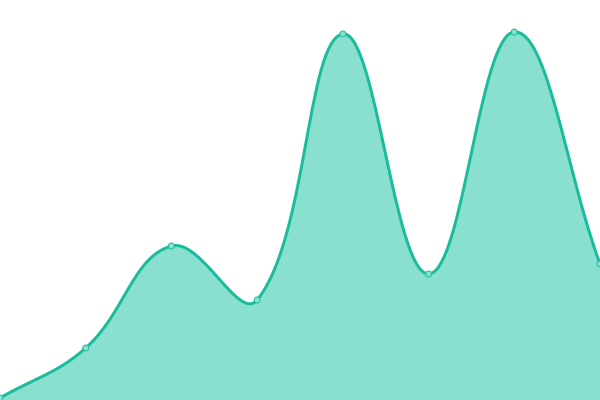
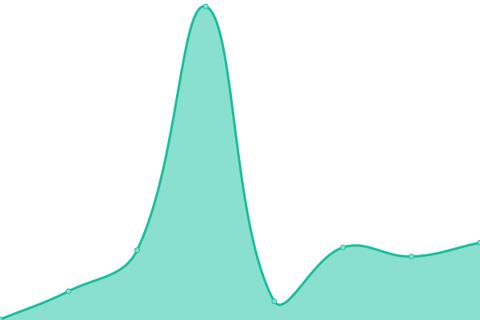
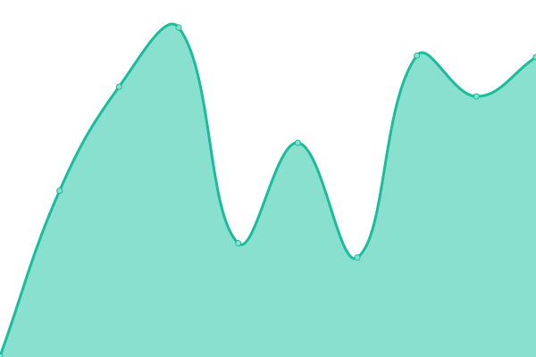

# [📈 Live Status](https://Jrp-best-hosting.github.io/status): <!--live status--> **🟧 Partial outage**

This repository contains the open-source uptime monitor and status page for [Jrp-best-hosting](https://Jrp-best-hosting.github.io/status), powered by [Upptime](https://github.com/upptime/upptime).

With [Upptime](https://upptime.js.org), you can get your own unlimited and free uptime monitor and status page, powered entirely by a GitHub repository. We use [Issues](https://github.com/Jrp-best-hosting/status/issues) as incident reports, [Actions](https://github.com/Jrp-best-hosting/status/actions) as uptime monitors, and [Pages](https://Jrp-best-hosting.github.io/status) for the status page.

<!--start: status pages-->
<!-- This summary is generated by Upptime (https://github.com/upptime/upptime) -->
<!-- Do not edit this manually, your changes will be overwritten -->
<!-- prettier-ignore -->
| URL | Status | History | Response Time | Uptime |
| --- | ------ | ------- | ------------- | ------ |
|  [Website](https://jrp.best) | 🟩 Up | [website.yml](https://github.com/Jrp-best-hosting/status/commits/HEAD/history/website.yml) | 

 813ms
     
 | 

<a href="https://status.jrp.best/history/website">98.77%</a>
    

|  [Node 1](https://none.jrp.best) | 🟥 Down | [node-1.yml](https://github.com/Jrp-best-hosting/status/commits/HEAD/history/node-1.yml) | 

 0ms
     
 | 

<a href="https://status.jrp.best/history/node-1">0.00%</a>
    

|  [Node 2](http://ntwo.jrp.best) | 🟥 Down | [node-2.yml](https://github.com/Jrp-best-hosting/status/commits/HEAD/history/node-2.yml) | 

 0ms
     
 | 

<a href="https://status.jrp.best/history/node-2">0.00%</a>
    

|  [Node 3](http://ntre.jrp.best) | 🟥 Down | [node-3.yml](https://github.com/Jrp-best-hosting/status/commits/HEAD/history/node-3.yml) | 

 0ms
     
 | 

<a href="https://status.jrp.best/history/node-3">0.00%</a>
    

|  [API Server](http://api.jrp.best) | 🟥 Down | [api-server.yml](https://github.com/Jrp-best-hosting/status/commits/HEAD/history/api-server.yml) | 

 0ms
     
 | 

<a href="https://status.jrp.best/history/api-server">0.00%</a>
    

|  [ShareX hosting](https://sharex.jrp.best) | 🟩 Up | [share-x-hosting.yml](https://github.com/Jrp-best-hosting/status/commits/HEAD/history/share-x-hosting.yml) | 

 373ms
     
 | 

<a href="https://status.jrp.best/history/share-x-hosting">98.84%</a>
    

|  [File server](https://img.jrp.best) | 🟥 Down | [file-server.yml](https://github.com/Jrp-best-hosting/status/commits/HEAD/history/file-server.yml) | 

 0ms
     
 | 

<a href="https://status.jrp.best/history/file-server">0.00%</a>
    

|  [Discord Tools](https://dtools.givinghawk.xyz) | 🟥 Down | [discord-tools.yml](https://github.com/Jrp-best-hosting/status/commits/HEAD/history/discord-tools.yml) | 

 0ms
     
 | 

<a href="https://status.jrp.best/history/discord-tools">0.00%</a>
    

<!--end: status pages-->

[**Visit our status website →**](https://Jrp-best-hosting.github.io/status)

## 📄 License

- Powered by: [Upptime](https://github.com/upptime/upptime)
- Code: [MIT](./LICENSE) © [Jrp-best-hosting](https://Jrp-best-hosting.github.io/status)
- Data in the `./history` directory: [Open Database License](https://opendatacommons.org/licenses/odbl/1-0/)
